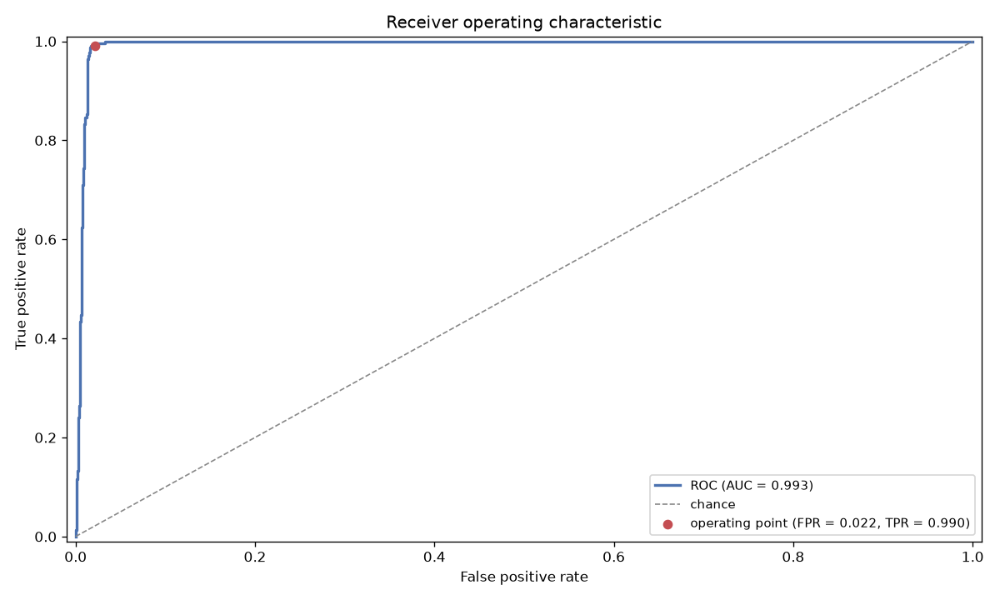
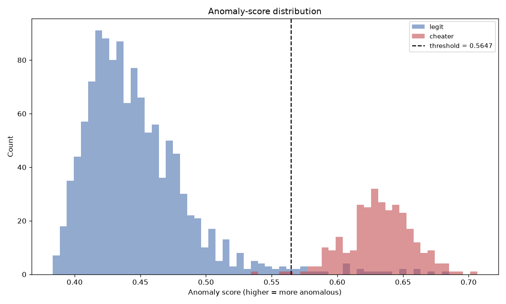
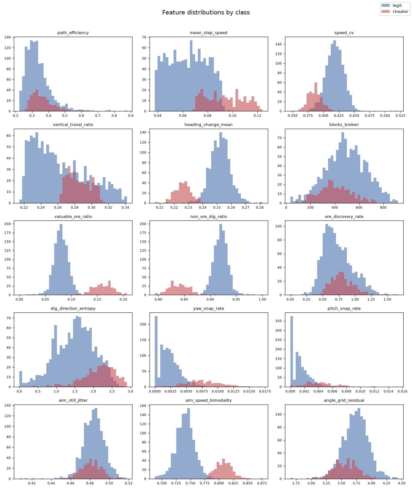
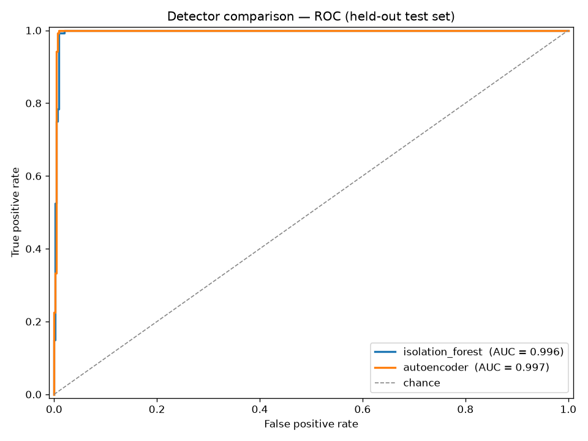
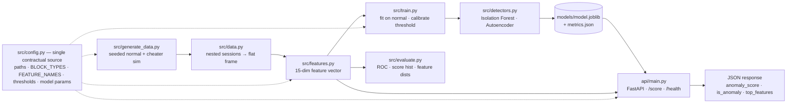

# Telemetry Anomaly Detector

> Real-time anomaly detection for 3D voxel-game telemetry. Flags X-ray / ESP-style
> cheating from per-tick player logs using an unsupervised Isolation Forest trained
> exclusively on legitimate play.

[](https://github.com/LILRINO71/telemetry-anomaly-detector/actions/workflows/ci.yml)
[](https://www.python.org/)
[](https://scikit-learn.org/)
[](https://fastapi.tiangolo.com/)
[](#run-with-docker)
[](#license)

---

## What this is

Cheaters in voxel mining games (think Minecraft-style worlds) use **X-ray** to see
through terrain and **aimbots** to snap to targets. They don't announce themselves
with a flag in the packet stream — they announce themselves through *behavior*:
they beeline straight to buried diamond, mine almost nothing but ore, and rotate
their view with inhuman precision.

This project turns a raw stream of per-tick telemetry (position, look angles, block
breaks) into **15 behavioral features**, then scores each play session with an
**Isolation Forest**. Because the model is trained *only on legitimate sessions*, it
never needs a labeled cheating dataset — it flags anything that doesn't look like
normal human play. A FastAPI service exposes the whole thing behind a single
`POST /score` endpoint a game server could call in real time.

The repo is deliberately end-to-end and reproducible: a seeded synthetic data
generator, a pure-function feature extractor, a calibrated model wrapper, a
training CLI, an evaluation/plotting CLI, and a typed inference API — all wired
through one contractual constants file.

> **Note:** the telemetry here is **synthetic**, produced by a seeded simulator. The
> feature engineering encodes hypotheses about how cheating manifests behaviorally;
> see [Limitations](#limitations--future-work).

---

## Results

Trained on 1,500 simulated sessions (1,200 legitimate + 300 cheating) at the default
overlap setting — where cheaters throttle **88% of the way** toward human behavior
(`--difficulty 0.88`, `--seed 1337`) — and evaluated on a stratified 30% hold-out:

| Metric | Value |
| ------ | ----- |
| ROC-AUC | **0.996** |
| Average precision | 0.975 |
| Precision | 0.952 |
| Recall | 0.992 |
| F1 | 0.971 |
| False-positive rate | ~1.3% (target ≤ 2%) |
| Confusion `(TN, FP, FN, TP)` | `444, 6, 1, 119` |

These numbers come straight from `models/metrics.json` and are reproducible with
`python -m src.train`. A near-perfect *ranking* (AUC) with a deliberately strict
false-positive budget is the right shape for anti-cheat: a wrongly banned player is
far costlier than a missed one, so the operating point trades a little recall for
very few false alarms.

| ROC curve | Anomaly-score distribution |
| --------- | -------------------------- |
|  |  |



Regenerate the figures anytime with
`python -m src.evaluate --dataset data/raw/sessions.jsonl --model models/model.joblib`.

---

## Two detectors: a head-to-head comparison

The project ships **two** unsupervised detectors behind one shared interface
([`src/detectors.py`](src/detectors.py)), so you can swap models without touching
the trainer or the API:

- **Isolation Forest** — a tree ensemble that isolates anomalies in a few random splits.
- **Autoencoder** — a bottleneck neural network (`15 → 12 → 6 → 12 → 15`, scikit-learn
  `MLPRegressor`) trained to *reconstruct* legitimate behavior. Cheaters fall outside
  the learned "normal" manifold and reconstruct poorly, so the **mean squared
  reconstruction error** is the anomaly score.

Both are trained on the *same* normal split and evaluated on the *same* hold-out
(`python -m src.compare`, results in `models/comparison.json`):

| Metric | Isolation Forest | Autoencoder |
| ------ | ---------------- | ----------- |
| ROC-AUC | 0.996 | 0.997 |
| Average precision | 0.975 | 0.979 |
| Precision | **0.952** | 0.916 |
| Recall | 0.992 | **1.000** |
| F1 | **0.971** | 0.956 |
| Confusion `(TN, FP, FN, TP)` | `444, 6, 1, 119` | `439, 11, 0, 120` |



**The interesting part isn't a winner — it's the tradeoff.** The two models sit on
different points of the precision/recall frontier: the **autoencoder catches every
cheater** (recall 1.0, zero misses) but raises more false alarms, while the
**Isolation Forest is more precise** (fewer wrongful flags) at the cost of missing
one cheater. Which you deploy depends on whether your anti-cheat prioritizes
*catching everyone* or *never banning an innocent player*. The Isolation Forest is
the default (best F1 and precision, and near-instant inference); train the other with
`python -m src.train --model autoencoder`.

---

## Interactive demo

An interactive **Streamlit** dashboard ([`streamlit_app.py`](streamlit_app.py)) makes the
whole thing clickable — generate or paste a player session, pick a detector, and watch
the verdict update live:

```bash
pip install -r requirements-demo.txt
streamlit run streamlit_app.py     # then open http://localhost:8501
```

The model trains on first load and is cached, so **no pre-trained artifact is needed** —
which also makes it one-click deployable to
[Streamlit Community Cloud](https://streamlit.io/cloud) (point it at `streamlit_app.py`).

What you can do:

- **Generate** a normal or cheating session and drag the *mimicry* slider to watch a
  blatant cheater blend toward human behavior (and the verdict flip).
- **Paste** your own session JSON (the same schema as `POST /score`).
- See the **anomaly score vs. the calibrated threshold**, the flag decision, the **top
  features** that drove it (signed z-scores), and top-down **path** + **aim-over-time**
  plots that make the cheating *visible* (beelines and robotic snaps vs. human wandering).

---

## Run with Docker

A multi-stage [`Dockerfile`](Dockerfile) builds two images — the API (with a trained
model baked in) and the Streamlit demo — and [`docker-compose.yml`](docker-compose.yml)
runs both with one command:

```bash
docker compose up --build
#   API   -> http://localhost:8000   (interactive docs at /docs)
#   Demo  -> http://localhost:8501
```

Or build and run a single service:

```bash
docker build -t tad-api .                    # API (default target); trains + bakes the model
docker run --rm -p 8000:8000 tad-api

docker build -t tad-demo --target demo .     # Streamlit demo
docker run --rm -p 8501:8501 tad-demo
```

The API image trains the model at build time, so `docker run` serves real scores
immediately — no volume mount or startup step. Both images run as a non-root user and
declare a `HEALTHCHECK`. CI builds both targets and smoke-tests the running API on every
push, so the Dockerfile can't silently rot.

---

## Why unsupervised anomaly detection

Cheating is **rare, unlabeled, and adversarial**. We can't assume we have a clean,
balanced set of "cheater" examples, and cheaters change their tooling constantly.
So instead of learning "what a cheater looks like" (supervised), we learn **"what
normal looks like"** and measure how far a session deviates from it. That is
precisely the job of an unsupervised anomaly detector.

### The math

An Isolation Forest is an ensemble of `ISOFOREST_N_ESTIMATORS` (300) random binary
trees called **isolation trees** (`iTrees`). Each tree is built by repeatedly:

1. picking a random feature, and
2. picking a random split value between that feature's min and max,

recursively partitioning the data until every point is isolated in its own leaf.

The key insight: **anomalies are few and different, so they get isolated in very
few splits — they sit near the root. Normal points look like everything else and
require many splits to peel apart — they sit deep in the tree.** The *path length*
from the root to a point's leaf is therefore a natural anomaly signal: short path =
anomalous.

We average the path length `h(x)` a point receives across all trees, `E[h(x)]`, and
normalize by `c(n)` — the expected path length of an unsuccessful search in a Binary
Search Tree over `n` samples, which corrects for tree size:

```
c(n) = 2 * H(n - 1) - (2 * (n - 1) / n)          where H(i) ≈ ln(i) + 0.5772156649 (Euler–Mascheroni)
```

The anomaly score is:

```
s(x, n) = 2 ^ ( - E[h(x)] / c(n) )
```

Interpretation of `s(x, n)`:

| `E[h(x)]` relative to `c(n)` | `s(x, n)`         | Meaning                     |
| ---------------------------- | ----------------- | --------------------------- |
| much shorter than average    | → 1               | strong anomaly (likely cheat) |
| ≈ average                    | ≈ 0.5             | indistinguishable from normal |
| much longer than average     | → 0               | very normal                 |

scikit-learn's `IsolationForest` exposes this via `score_samples(X)`, which returns
the **negated** score (higher = more normal). This project standardizes on a single
`anomaly_score` where **higher means more anomalous**, so the raw sklearn output is
flipped inside the model wrapper (`src/model.py`).

### Calibrated threshold, not `predict()`

We do **not** rely on `contamination` to hand us a hard label. Instead we fit on
legitimate data, take the distribution of anomaly scores over the *normal* set, and
pick the decision threshold at the empirical quantile that yields a **target
false-positive rate** of `TARGET_FPR` (2%). A session is flagged only if its
`anomaly_score` exceeds that calibrated threshold. This makes the operating point
explicit and auditable — critical when a false positive means banning a legitimate
player.

---

## The behavioral features

Every session is reduced to a fixed-length vector of `N_FEATURES` (15) values. The
order is **contractual** — it is defined once by `FEATURE_NAMES` in
[`src/config.py`](src/config.py) and must never be reordered without retraining,
because the column order *is* the model's input schema.

The three families are **movement** (how you travel), **mining** (what you dig), and
**aim** (how you look).

| # | Feature | Normal player | Cheater | Why it separates |
| -- | ------- | ------------- | ------- | ---------------- |
| 0 | `path_efficiency` | low — wanders, backtracks, explores | **high** — straight beeline to known ore | X-ray reveals the target, so the path is a near-straight line (net displacement ≈ distance travelled) |
| 1 | `mean_step_speed` | moderate, variable | ~ similar | weakly informative alone; a context/normalizer feature |
| 2 | `speed_cv` | high — stop-and-go, look around, react | **low** — constant-velocity tunnelling | coefficient of variation of step speed; bots hold a steady pace |
| 3 | `vertical_travel_ratio` | low — mostly horizontal exploration | **high** — dives straight down to deep ore | fraction of travel spent on the vertical axis; X-ray users drop to the diamond layer directly |
| 4 | `heading_change_mean` | high — frequent turns while exploring | **low** — few course corrections | mean absolute heading change per step; a known destination needs almost no turning |
| 5 | `blocks_broken` | varies | ~ varies | raw count of blocks broken; a context feature that scales the ratios below |
| 6 | `valuable_ore_ratio` | low — mostly stone/dirt/gravel | **high** — mines mostly the good stuff | share of broken blocks in `VALUABLE_ORES`; legit miners churn through worthless rock |
| 7 | `non_ore_dig_ratio` | high — lots of wasted digging | **low** — almost no wasted digging | share of non-valuable breaks; X-ray means you only dig what pays |
| 8 | `ore_discovery_rate` | low — luck-limited | **high** — finds ore per block travelled | valuable ore found per unit distance; seeing through walls inflates the hit rate |
| 9 | `dig_direction_entropy` | high — digs every which way | **low** — concentrated along one axis | Shannon entropy over `DIRECTION_BINS` (8) azimuth bins; targeted mining is directionally narrow |
| 10 | `yaw_snap_rate` | low — smooth human panning | **high** — instantaneous horizontal snaps | fraction of ticks with `|Δyaw|` above `SNAP_DEG_THRESHOLD` (30°); aimbots teleport the crosshair |
| 11 | `pitch_snap_rate` | low — smooth vertical panning | **high** — instantaneous vertical snaps | same idea on the pitch axis |
| 12 | `aim_still_jitter` | present — hands never hold perfectly still | **low** — dead-still aim | angular micro-variance while "holding" aim (speed below `LOW_AIM_SPEED_DEG`, 2°/tick); humans always tremor, bots don't |
| 13 | `aim_speed_bimodality` | low — a continuous spread of speeds | **high** — either ~0 or a huge snap | fraction of ticks in the still (`<2°/tick`) or fast (`>HIGH_AIM_SPEED_DEG`, 25°/tick) modes; bot aim has nothing in between |
| 14 | `angle_grid_residual` | high — angles land anywhere | **low** — angles land on a grid | mean residual to the nearest multiple of `ANGLE_GRID_DEG` (15°); many aimbots quantize rotation |

All thresholds above are the named constants in `src/config.py`, so the extractor,
the generator, and this table can never silently drift apart.

---

## Architecture



**Data flow:** `generate_data.py` writes seeded per-tick sessions → `data.py` flattens
the nested session records into a per-tick frame → `features.py` folds each session
into a 15-dim vector → `train.py` fits `model.py`'s Isolation Forest on normal
sessions, calibrates the threshold to `TARGET_FPR`, and persists
`models/model.joblib` + `models/metrics.json` → `api/main.py` loads that artifact and
serves live scoring. Every arrow's schema is pinned by `config.py`.

### Repository layout

```
telemetry-anomaly-detector/
├── src/
│   ├── config.py         # contractual constants (paths, features, thresholds, model params)
│   ├── generate_data.py  # seeded synthetic telemetry generator (normal + cheater)
│   ├── data.py           # nested sessions → flat per-tick frame + labels (train/eval bridge)
│   ├── features.py       # per-tick telemetry → 15-dim behavioral feature vector
│   ├── scoring.py        # framework-free scoring helpers (shared by the demo)
│   ├── detectors.py      # shared interface + IsolationForest and Autoencoder detectors
│   ├── model.py          # back-compat shim: AnomalyModel = IsolationForestDetector
│   ├── train.py          # CLI: featurize → fit (--model) → calibrate → persist
│   ├── compare.py        # CLI: benchmark both detectors head-to-head (table + ROC)
│   └── evaluate.py       # CLI: metrics + ROC / score-hist / feature-distribution figures
├── api/
│   └── main.py           # FastAPI app: POST /score, POST /score/batch, GET /health
├── tests/                # pytest suite (generate, features, detectors, model, API)
├── data/
│   ├── raw/              # generated per-tick session logs (gitignored)
│   └── sample/           # small committed demo sessions
├── models/               # model.joblib (gitignored, regenerable) + metrics.json
├── reports/              # ROC / score / feature-distribution figures
├── streamlit_app.py      # interactive Streamlit demo (deployable to Streamlit Cloud)
├── Dockerfile            # multi-stage build: api (default) + demo targets
├── docker-compose.yml    # run the API and the demo together
├── .dockerignore
├── requirements.txt      # loose top-level dependencies
├── requirements-lock.txt # exact reproducible pins (tested on Python 3.14)
├── requirements-demo.txt # core deps + Streamlit, for the demo
├── pyproject.toml        # pytest + ruff configuration
├── Makefile              # make data / train / compare / demo / serve / docker-* / test
└── .github/workflows/ci.yml
```

---

## Quickstart

Requires **Python 3.14**. The pinned stack is numpy 2.5, pandas 3.0, scikit-learn 1.9,
scipy 1.18, FastAPI 0.139, pydantic v2, uvicorn 0.49, joblib 1.5, matplotlib 3.11.

### 1. Create a virtual environment and install

**Windows (PowerShell):**

```powershell
py -3.14 -m venv .venv
.\.venv\Scripts\Activate.ps1
python -m pip install --upgrade pip
pip install -r requirements.txt
```

**Unix (macOS / Linux, bash/zsh):**

```bash
python3.14 -m venv .venv
source .venv/bin/activate
python -m pip install --upgrade pip
pip install -r requirements.txt
```

For a byte-for-byte reproducible environment, install `requirements-lock.txt` instead.

### 2. Train the model

This synthesizes seeded telemetry, extracts features, fits the Isolation Forest on
legitimate sessions, calibrates the threshold to a 2% false-positive rate, and writes
`models/model.joblib` + `models/metrics.json`. It prints the evaluation report.

```bash
python -m src.train                     # Isolation Forest (default)
python -m src.train --model autoencoder  # or the neural autoencoder
```

### 3. (Optional) Compare the models, or render evaluation figures

Benchmark both detectors head-to-head, and/or write a dataset to disk and render the
report figures:

```bash
python -m src.compare                                # both models, table + ROC figure
python -m src.generate_data --n-normal 1200 --n-cheater 300 --out data/raw/sessions.jsonl
python -m src.evaluate --dataset data/raw/sessions.jsonl --model models/model.joblib
```

### 4. Serve the API

```bash
uvicorn api.main:app --port 8000
```

Open the interactive docs at **http://localhost:8000/docs**, or hit
`GET http://localhost:8000/health` to confirm the model artifact loaded.

### 5. Run the tests

```bash
pytest
```

> On Unix you can drive all of the above with the `Makefile`: `make install`,
> `make train`, `make evaluate`, `make serve`, `make test`.

---

## Using the `/score` endpoint

`POST /score` accepts one play session — a list of per-tick telemetry events — and
returns the anomaly score, the flag decision against the calibrated threshold, and
the features that contributed most to the verdict (ranked by `|zscore|`) so the
decision is explainable.

A session must contain at least `MIN_EVENTS` (60) ticks — 3 seconds at 20 ticks per
second — or the service rejects it as too short to score reliably. For stable
scoring it should be a **complete session** of comparable length to training data
(see [Limitations](#limitations--future-work)).

### Per-event schema

Each element of `events` is one game tick:

| field | type | notes |
| ----- | ---- | ----- |
| `tick` | int \| null | monotonic index within the session (optional; used for ordering) |
| `x`, `y`, `z` | float | world position in blocks (`y` is vertical) |
| `yaw` | float | horizontal look angle, degrees |
| `pitch` | float | vertical look angle, degrees |
| `block_type` | string \| null | block broken this tick (one of `BLOCK_TYPES`), or `null` |

### Example request

```bash
curl -X POST http://localhost:8000/score \
  -H "Content-Type: application/json" \
  -d '{
    "session_id": "player-42-session-7",
    "events": [
      {"tick": 0, "x": 128.0, "y": 63.0, "z": -64.0, "yaw": 90.0, "pitch": 2.0,  "block_type": null},
      {"tick": 1, "x": 128.0, "y": 62.0, "z": -64.0, "yaw": 90.4, "pitch": 15.0, "block_type": "stone"},
      {"tick": 2, "x": 128.0, "y": 61.0, "z": -64.0, "yaw": 45.0, "pitch": 45.0, "block_type": "diamond_ore"}
    ]
  }'
```

> The `events` array above is abbreviated to three ticks for readability. A real
> request carries at least 60 events, each with the schema in the table above.

### Example response

```json
{
  "session_id": "player-42-session-7",
  "anomaly_score": 0.7466,
  "is_anomaly": true,
  "n_events": 991,
  "top_features": [
    {"feature": "yaw_snap_rate",       "value": 0.161, "zscore": 88.70},
    {"feature": "pitch_snap_rate",     "value": 0.081, "zscore": 56.60},
    {"feature": "non_ore_dig_ratio",   "value": 0.328, "zscore": -41.68},
    {"feature": "valuable_ore_ratio",  "value": 0.672, "zscore": 41.68},
    {"feature": "heading_change_mean", "value": 0.059, "zscore": -27.43}
  ],
  "model_version": "0.1.0"
}
```

`anomaly_score` is oriented so **higher = more anomalous**. `is_anomaly` is `true`
when the score crosses the threshold calibrated to `TARGET_FPR` during training.
`top_features` ranks the five features whose standardized value (`zscore`, computed
from the model's own `StandardScaler`) deviates most from legitimate play — a signed,
human-readable explanation of *why* the session scored the way it did. `model_version`
echoes `MODEL_VERSION` so clients can detect artifact changes.

`POST /score/batch` accepts `{"sessions": [ ... ]}` and returns one verdict per session.

### Error responses

| Situation | Status | Body |
| --------- | ------ | ---- |
| Fewer than `MIN_EVENTS` (60) events | `422 Unprocessable Entity` | detail naming the minimum |
| Malformed event (missing / wrongly-typed field) | `422 Unprocessable Entity` | pydantic validation detail |
| Model artifact not loaded | `503 Service Unavailable` | detail pointing at the expected model path |

---

## Configuration reference

All tunables live in [`src/config.py`](src/config.py) and are imported (never
redefined) by every other module. The most relevant knobs:

| Constant | Value | Role |
| -------- | ----- | ---- |
| `TICKS_PER_SECOND` | 20 | simulation tick rate |
| `DEFAULT_SEED` | 1337 | reproducibility seed for the generator |
| `BLOCK_TYPES` | 8 block types | the block taxonomy the game emits |
| `VALUABLE_ORES` | iron/gold/redstone/diamond | ores a cheater beelines toward |
| `MIN_EVENTS` | 60 | minimum ticks to score a session |
| `SNAP_DEG_THRESHOLD` | 30.0 | `|Δyaw/pitch|` per tick counted as a robotic snap |
| `LOW_AIM_SPEED_DEG` | 2.0 | "still" aim window (deg/tick) |
| `HIGH_AIM_SPEED_DEG` | 25.0 | "fast" aim window (deg/tick) |
| `ANGLE_GRID_DEG` | 15.0 | grid aimbots snap to; we measure the residual |
| `DIRECTION_BINS` | 8 | azimuth bins for dig-direction entropy |
| `FEATURE_NAMES` | 15 names | **contractual** feature order = model input schema |
| `ISOFOREST_N_ESTIMATORS` | 300 | number of isolation trees |
| `ISOFOREST_CONTAMINATION` | `"auto"` | sklearn's own offset (we override with a calibrated threshold) |
| `TARGET_FPR` | 0.02 | false-positive rate the decision threshold is calibrated to |
| `MODEL_VERSION` | `"0.1.0"` | stamped into the API and every response |

---

## Design notes

- **Trained on normal play only.** The Isolation Forest never sees a cheating label.
  It learns the shape of legitimate behavior and flags outliers, so it generalizes
  to cheat tooling it was never shown.
- **Explainable by construction.** Every flag ships with the top contributing
  features and their signed z-scores, so a reviewer can see *why* a session scored
  high rather than trusting a black box.
- **Calibrated, not thresholded by luck.** The operating point is chosen against an
  explicit `TARGET_FPR`, because in anti-cheat a false positive is a wrongly banned
  player.
- **One source of truth.** Feature order, block taxonomy, thresholds, model
  hyperparameters, and API metadata all come from `config.py`, so the generator,
  extractor, model, and docs cannot drift out of sync.
- **Fully reproducible.** Seeded generation means `python -m src.train` produces the
  same model and metrics on any machine with the pinned stack; CI lints, format-checks,
  and runs the suite on every push.

---

## Limitations & future work

- **Session-length sensitivity.** Some features are not length-invariant — `blocks_broken`
  is a raw count, and `path_efficiency` follows a `√t`-style law for a wandering
  player (shorter windows look artificially straight). The model is trained on complete
  sessions, so scoring should use windows of comparable length; very short windows can
  push legitimate play out of distribution and trigger false positives. A production
  deployment should train and score on **fixed-size sliding windows**, or normalize
  every feature to be length-invariant.
- **In-sample threshold calibration.** The decision threshold is currently calibrated on
  the same normal data used to fit the forest. A dedicated held-out calibration split
  would give a less optimistic operating point.
- **Synthetic data.** Behavior is simulated, not captured from a live server, so the
  feature engineering encodes our *hypotheses* about X-ray/ESP. Real telemetry would add
  confounders (network lag, AFK players, legitimate speedrunners) the simulator omits.
- **Static, non-adversarial model.** Cheats evolve; there is no drift handling or online
  retraining, and a determined adversary who mimics human jitter and pathing (high
  `--difficulty`) can slip under the strict-FPR operating point.
- **Deeper models.** A neural **autoencoder** is now implemented and benchmarked (see
  [the comparison](#two-detectors-a-head-to-head-comparison)); it still consumes the same
  hand-built aggregate features. A true end-to-end **temporal model** (LSTM / temporal-CNN
  over the raw tick sequence) that learns behavior directly from the stream is the natural
  next step.

---

## License

MIT — see [`LICENSE`](LICENSE).
